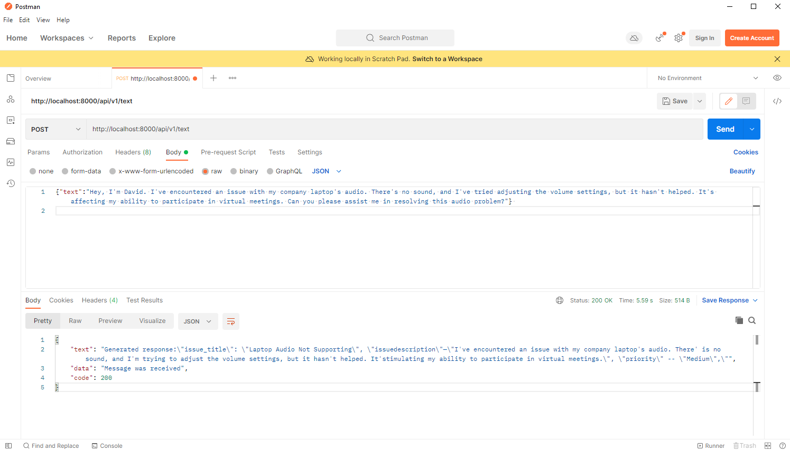

# Backend

## Project Structure

    amos2023ws01-ticket-chat-ai/
    Backend
    │
    └── app
        ├── api                     
        │      └── v1
        │          └── text_endpoint.py
        │
        |
        ├── main.py
        │
        │
        └── requirements.txt

## Setup

1. **Navigate to Backend**:

    ```bash
    cd amos2023ws01-ticket-chat-ai/Backend
    ```

2. **Create and Activate a Virtual Environment** (Optional but recommended):

    ```bash
    python3 -m venv venv
    ```
    ```bash
    source venv/bin/activate
    ```

3. **Install the Dependencies:**

    ```bash
    pip install -r requirements.txt
    ```

## Running and Testing the Project

1. **Start the backend**:

    ```bash
    uvicorn app.main:app --reload
    ```

2. **Use the endpoints**: go to [SwaggerUI](http://localhost:8000/docs) **OR**
   try [Postman](https://www.postman.com/downloads/) with the base URL `http://localhost:8000/api/v1` + router path

    - Example of how to test endpoint with postman (Model is automatically run when we run the endpoint). 
   


3. **Run the tests**:

    ```bash
    pytest tests/
    ```

## Run Test Model

1. Navigate into `./backend/app/models/t5` directory.

2. Train the model by running the following command:

   ```bash
   python train_t5_model.py
   ```

3. Test the trained model by running the following command:

   ```bash
   python use_trained_t5_model.py
   ```

4. Test the untrained T5 model by running the following command:

   ```bash
   python train_t5_model.py
   ```