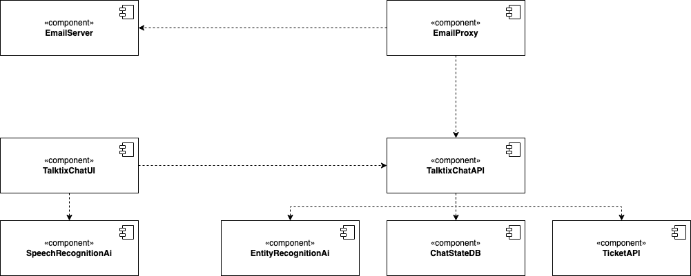
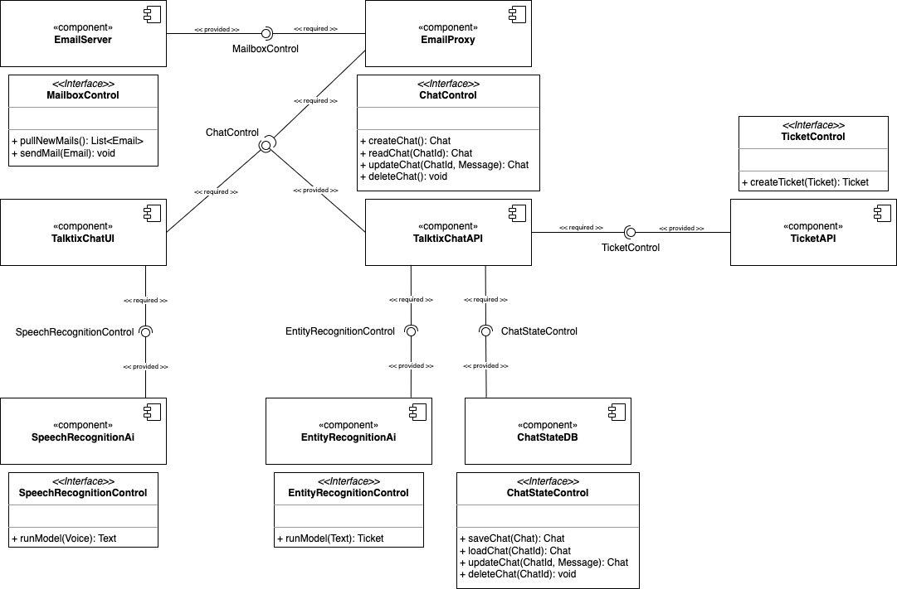
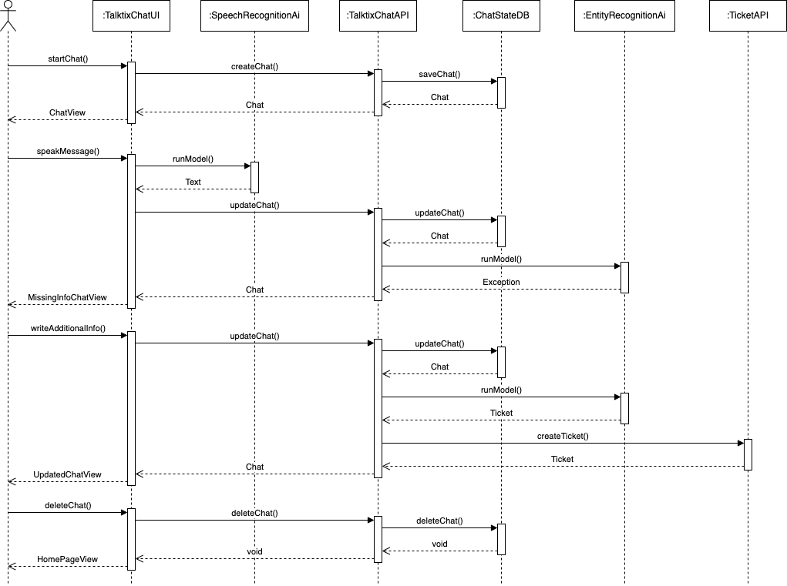
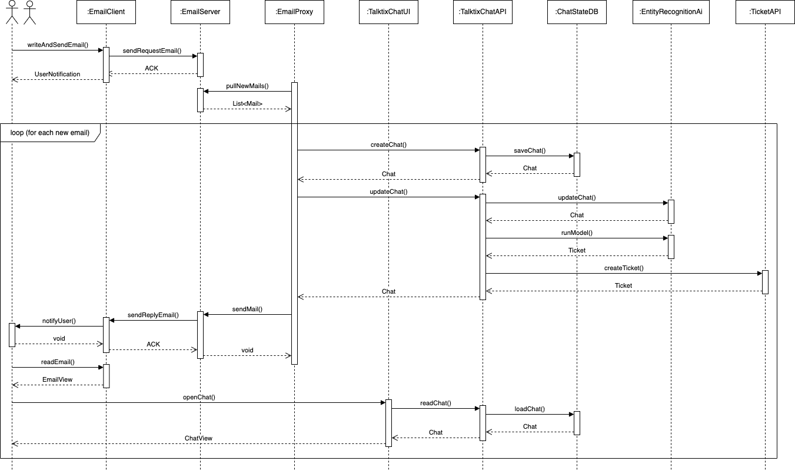
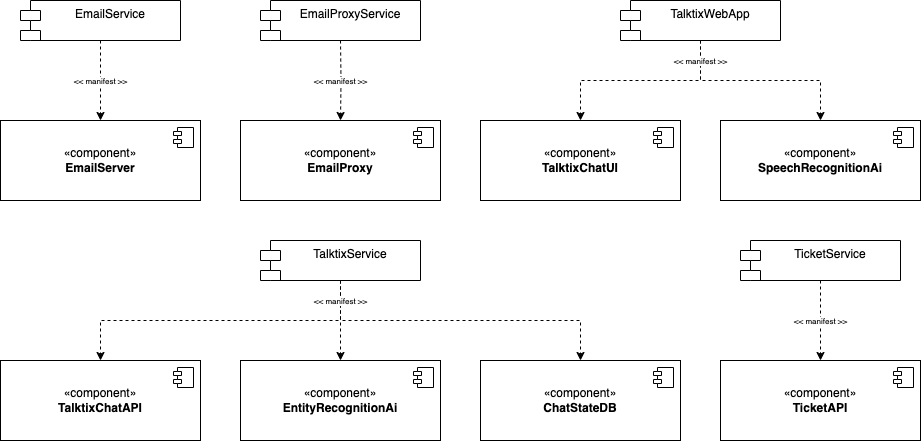

# Software Architecture

## Building Block View

### Whitebox Overall System

#### Contained Building Blocks

- TalktixChatUI: presents the chat to the user
- SpeechRecognitionAi: translates audio input into text
- TalktixChatAPI: defines endpoints of the backend
- EntityRecognitionAi: transforms the chat messages into a ticket
- ChatStateDB: stores the chat data
- TicketAPI: accepts tickets and is responsible for their processing
- EmailServer: manages email communication
- EmailProxy: opens a chat for received emails and replies via email

#### Important Components with Interfaces

## Runtime View

### Scenario 1: Creating a Ticket via Web App

### Scenario 2: Creating a Ticket via Email

## Technology Stack

### Frontend

- TypeScript
- Angular
- TypeChat???

### Backend

- Python
- FastAPI
- OpenAPI/Swagger???
- SQLAlchemy???
- PyTorch
- NumPy
- Transformers

## Realization View

## Architecture Decisions
