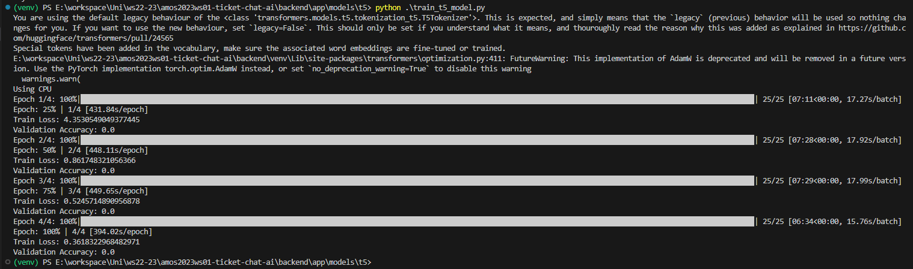

#Training Time Estimation

## Training infos T5-Small:
- GPU: NVIDIA GeForce GTX 960: 
- Parameters: 60 million 
- Epoch: 4 
- Dataset: 100

## Training infos T5-Large:
- 4 GPUs with 48 GB VRAM each
- Parameters: 220 million
- Epoch: 4
- Dataset: 1000

### Assumptions for Training AI to create Tickets:
- Dataset Scaling: 100 to 10,000  =>  100 times larger.
- Time per Epoch:  7 minutes per epoch => approximately 11.7 hours per epoch.
- Model Size Factor: T5 Base larger then T5 Small => approximately 23.4 hours per epoch. (training time does not increase linear to parameter size => only doubling)
- Hardware Improvement: Assuming Hardware is 4x more powerful => 5.85 hours per epoch.
- **Maximum Total Time Estimate**: For 4 epochs => 23.4 hours. 4 Gpus => **5,85 h** 

- Hardware Improvement: Assuming Hardware is 5x more powerful => 4.68 hours per epoch.
- **Minimum Total Time Estimate**: For 4 epochs => 18.72 hours. 4 Gpus => **4,68 h** 

### Assumptions for Training AI to Provide Solutions:
Assuming a 35% increase in complexity.
=> **Minium: 6.3h and Maximum: 7.9h**