#T5 Model Documentation

## Trainging time estimation

- **Training infos T5-Small:**
    - GPU: NVIDIA GeForce GTX 960: 
    - Parameters: 60 million 
    - Epoch: 4 
    - Dataset: 100

    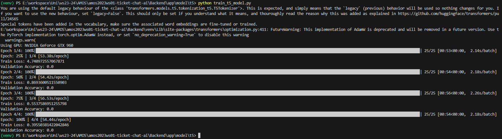

- **Training infos T5-Large:**
    - 4 GPUs with 48 GB VRAM each
    - Parameters: 220 million
    - Epoch: 4
    - Dataset: 1000

- **Assumptions for Training AI to create Tickets:**
    - Dataset Scaling: 100 to 10,000  =>  100 times larger.
    - Time per Epoch:  1 minutes per epoch => approximately 1.7 hours per epoch.
    - Model Size Factor: T5 Base larger then T5 Small => approximately 3.4 hours per epoch. (training time does not increase linear to parameter size => only doubling)
    - Hardware Improvement: Assuming Hardware is 4x more powerful => 0.85 hours per epoch.
    - **Maximum Total Time Estimate**: For 4 epochs => 3.4 hours. 4 Gpus => **0,85 h** 

    - Hardware Improvement: Assuming Hardware is 5x more powerful => 0.68 hours per epoch.
    - **Minimum Total Time Estimate**: For 4 epochs => 2.72 hours. 4 Gpus => **0,68 h** 

- **Assumptions for Training AI to Provide Solutions:**
    - Assuming a 35% increase in complexity.
    - => **Minium: 1.15h and Maximum: 0.92h**

## Azure ML:

- **Select the workspace FineTuneT5**
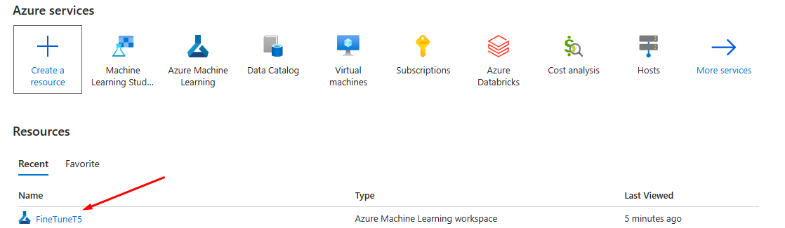
---
- **Launch Azure Machine Learning studio**
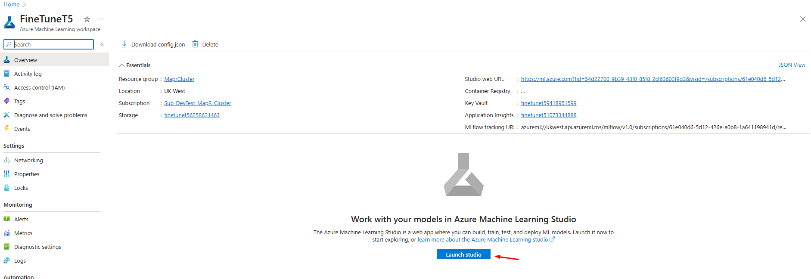
---
- **Our code is aleardy upload to the Notebooks**
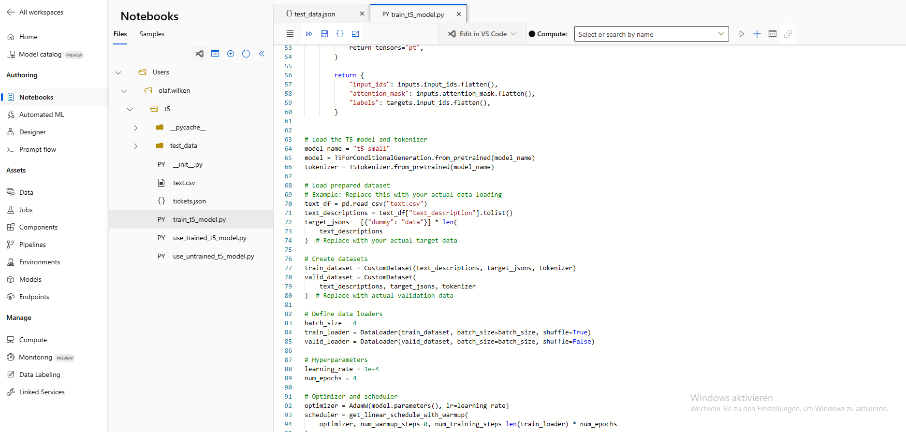
---
- **Next create a compute instance (Virtual machine) in order to run the code**
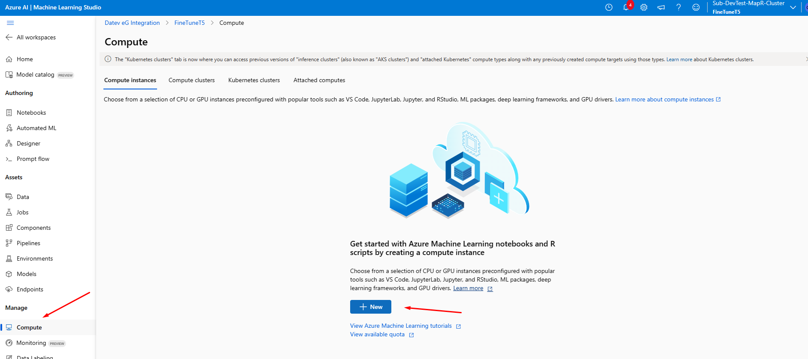
---
- **This is only for test/research purpose right  now. DO NOT CREATE THE INSTANCE WITH GPU**
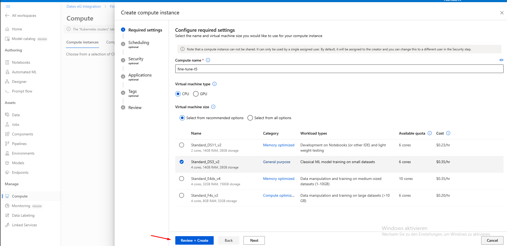

    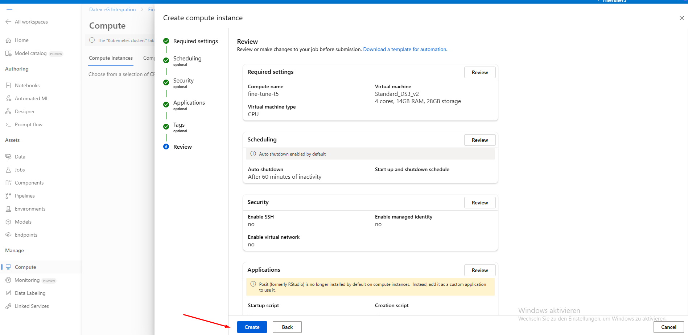
---
- **Run code**
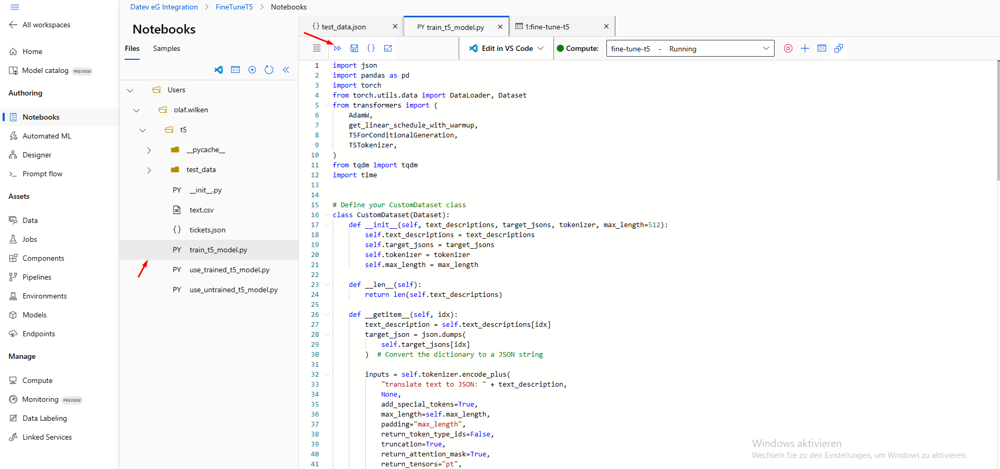
    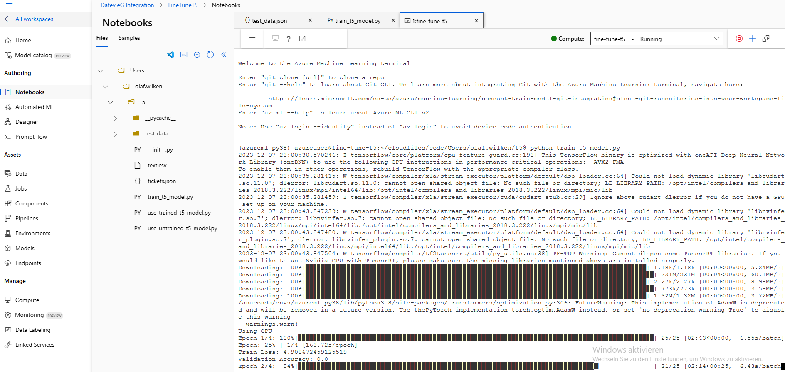
---
- **Fine tuned model can be find under fine_tuned_t5_model**
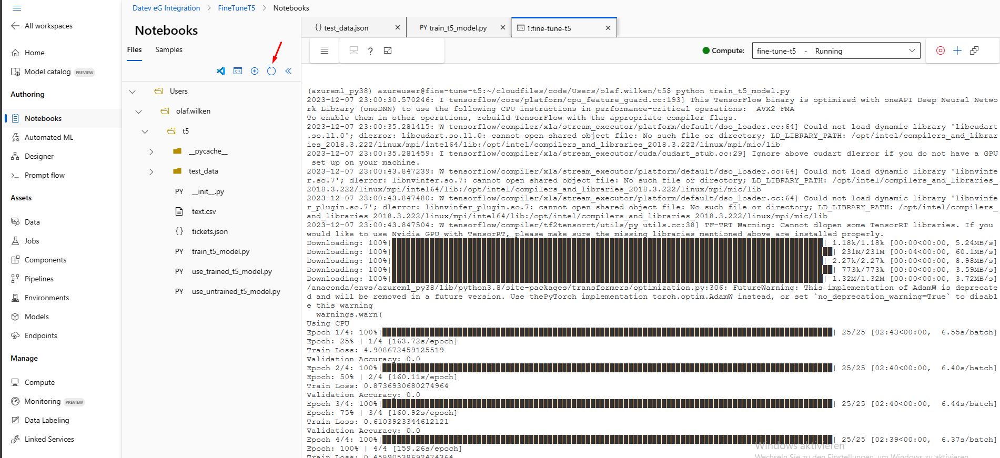
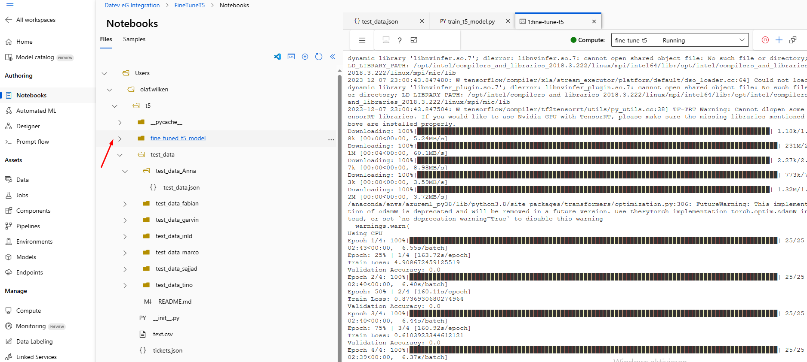
---
- **Dont forget to delete compute instance after testing**
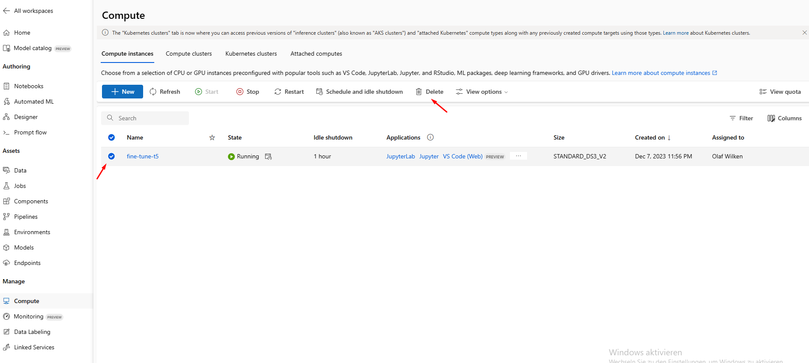

### Azure ML Remaining Research :
- Research how to connect a GitHub repository to a notebook.
- How to deploy the fine-tuned model to Hugging Face.
- Investigate the possibility to integrating Azure (Not so important only for comfort):
    - Investigate the possibility of integrating Azure with Visual Studio Code (VSCode extension)
    - Investigate the possibility of integrating Azure with Pycharm 
- Current data storage is in 'test_data' on the notebook:
    - Determine how to store it in Data Assets and access it later in the code.
- Investigate the pipeline asset: 
    - What can be done with it? 
    - Is it necessary, and should we use it?
- Investigate how to use Monitoring:
    - How can it be utilized for our training.

## NEW AI Strategy:
- Title will be generated via "czearing/article-title-generator" model from Hugging Face.
  - https://huggingface.co/czearing/article-title-generator
    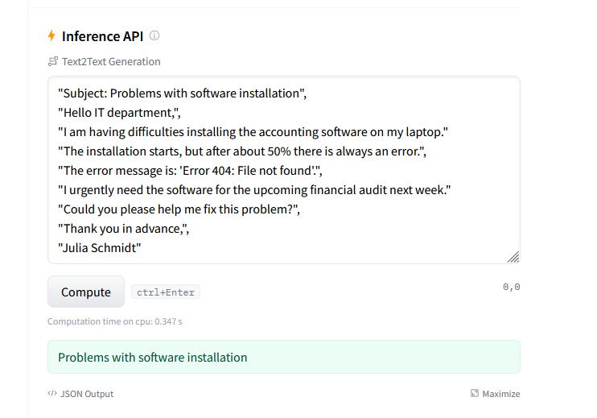

- AffectedPerson will be generated via "dslim/bert-base-NER" model from Hugging Face.
  - https://huggingface.co/dslim/bert-base-NER
    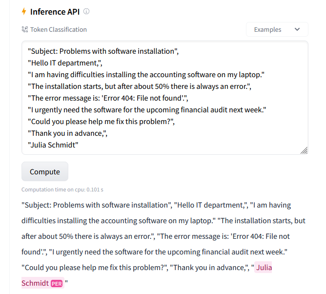

- Keywords will be generated via "ml6team/keyphrase-extraction-kbir-inspec" model from Hugging Face.
  - 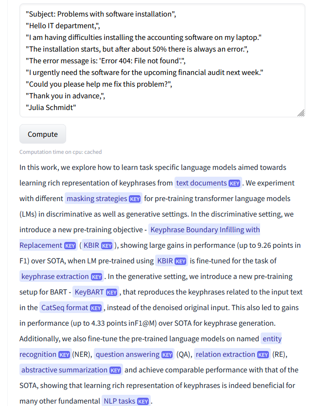

- Description will be the Problem description text (input text), where Subject and signatur is cut out.

- Service & requestType will be our main focus for training: For that will fine tune a text classification model.
- Category & priority will be our second focus: For that will fine tune a text classification model.
- CustomerPriority: For that will also fine tune a text classification model.